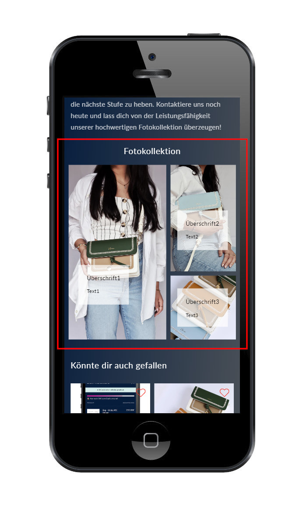
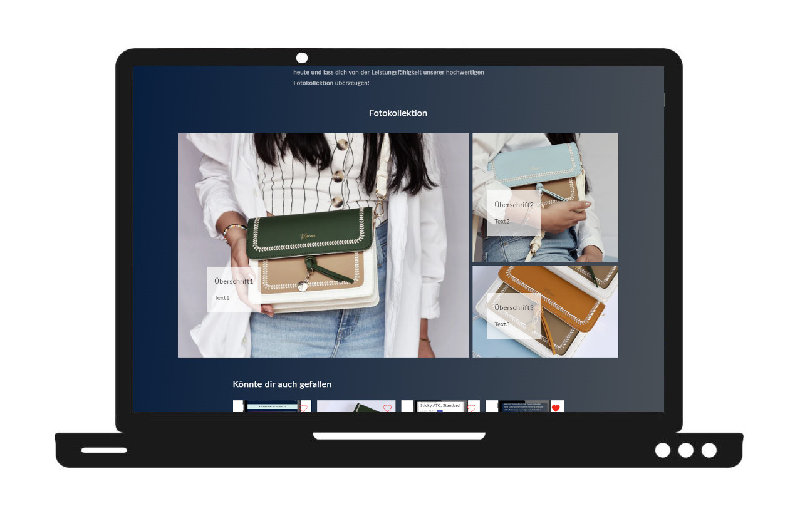

# 🖼️ Shopify Image Collage Section

A highly flexible, responsive image collage section for Shopify themes.  
Designed to showcase products, categories, or editorial content in a fully visual, grid-based layout.

---

## ✅ Features

- Theme Editor configurable grid layout (columns/rows)
- Independent configuration for desktop and mobile
- Optional image link, heading, subtext
- Per-image control of width & height via grid span
- Clean responsive layout using CSS Grid
- Supports up to 50 blocks
- Fully native – no app or JS required

---

## 🛠️ Settings

### Section Settings

| Setting                     | Description                              |
|-----------------------------|------------------------------------------|
| `Section Heading`           | Optional section title                   |
| `Desktop Columns`           | CSS value (e.g. `repeat(4, 1fr)`, `2fr 1fr`) |
| `Desktop Rows`              | CSS value (e.g. `250px 250px`, `auto`)   |
| `Mobile Columns`            | Mobile layout (e.g. `repeat(2, 1fr)`)    |
| `Mobile Rows`               | e.g. `auto auto`, `150px 150px`          |
| `Desktop Side Padding`      | e.g. `5%`, `40px`                        |

### Block Settings

| Setting                 | Description                                 |
|-------------------------|---------------------------------------------|
| `Image`                 | Image picker                                |
| `Optional Link`         | Optional link for entire image              |
| `Heading Text`          | Optional text shown over image              |
| `Subtext`               | Optional smaller text below heading         |
| `Columns to span`       | How many grid columns this image should span (width) |
| `Rows to span`          | How many grid rows this image should span (height)   |

---

## 📱 Responsive Behavior

- Desktop grid is controlled via inline style
- Mobile grid layout uses a media query
- Overlay text sizes adjust on smaller screens

---

## 🎯 Use Cases

- Lifestyle image galleries
- Editorial homepage sections
- Product highlights
- Category landing layouts

---

## 📱 Mobile

## 💻 Desktop

---

## 🔗 Live Demo

[➡ View in Demo Store](https://testshopstefanegger.myshopify.com/products/image-collection)
PW: sdev
---

## 🧑‍💻 Author

Built by SDEV Solutions – Shopify Theme Development
→ Clean Liquid, CSS Grid, and Theme Editor logic.  
Ready for use in any 2.0-compatible theme.
