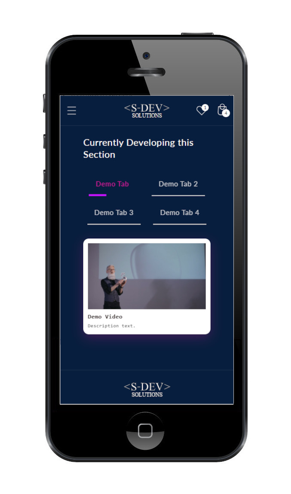
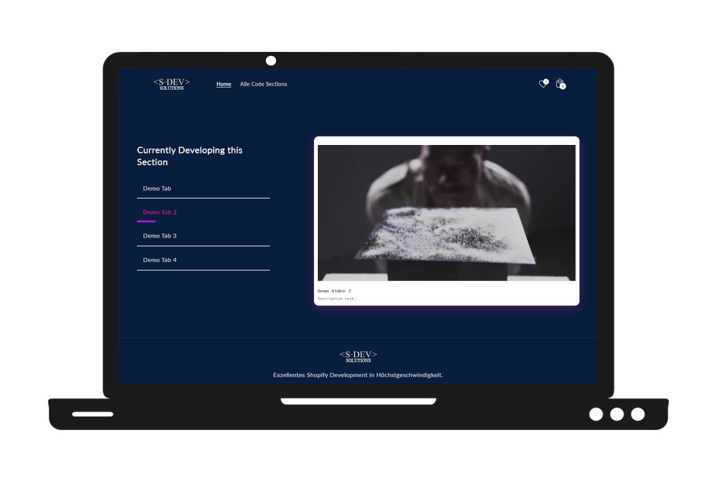

# 🎬 Media Showcase Tabs

A media showcase section with tabbed navigation.  
Ideal for storytelling, product highlights, or educational content.

---

## ✨ Features
- Tabbed navigation with text labels
- MP4 video or image per tab
- Auto-play progress bar for videos
- Custom section heading
- Optional shadow around media
- Adjustable height (small → fullscreen)
- Responsive + accessible (ARIA + keyboard nav)
- ARIA roles + keyboard accessibility

---

## ⚙️ Settings

### Section Settings
| Setting                   | Description                                  |
|---------------------------|----------------------------------------------|
| `Section Heading`          | Heading above the tabs                      |
| `Enable Shadow`            | Adds a shadow to active media panel         |
| `Section Height on Desktop`| Media height (small → fullscreen)           |

### Block Settings
| Setting                    | Description                                 |
|----------------------------|---------------------------------------------|
| `Menu Text`                 | Text shown in the tab navigation           |
| `Image`                     | Fallback image if no Video provided        |
| `Video URL (MP4)`           | MP4 video URL (overrides image)            |
| `Title`                     | Title shown in the content panel           |
| `Description`               | Description below title                    |

---

## 📱 Responsive Behavior

- The tab navigation and media panels adapt fluidly to mobile, tablet, and desktop layouts.
- Video and image scaling ensures optimal display without cropping or distortion.
- Overlay text and controls adjust in size for smaller screens to maintain readability and usability.

---

## 🎯 Use Cases

- Product storytelling (e.g. show development or manufacturing process)
- Feature highlights (e.g. explain key product features)
- Educational or how-to videos (e.g. tutorials directly in your store)
- Press or media showcase (e.g. reviews, awards, media coverage)
- Interactive brand experiences (e.g. campaigns or event highlights)

---

## 📱 Mobile View  

## 💻 Desktop View  

---

## 🔗 Live Demo  
➡ [View Live Demo](https://testshopstefanegger.myshopify.com/products/interactive-media-tabs)  
PW: sdev

---

## 🧑‍💻 Author

Built by SDEV Solutions – Shopify Theme Development
→ Clean Liquid, CSS, HTML, JS, and Theme Editor logic.
Works with all Shopify 2.0-compatible themes.
