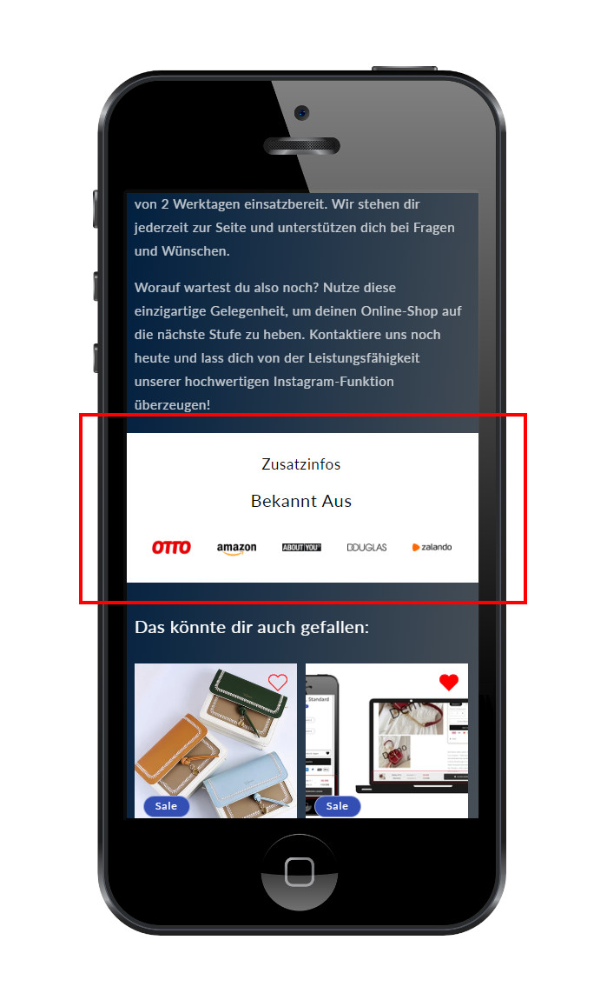
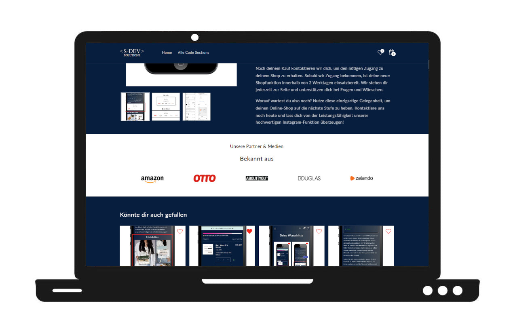

# 📰 Known From Section (S-DEV)

Display logos of well-known media, partners, or platforms to boost trust and social proof.

## ✨ Features

- Fully customizable heading and subheading
- Independent margin controls for headings and logo area
- Adjustable image size (mobile & desktop)
- Optional sticky integration into previous section
- Fully responsive and lightweight

## ⚙️ Settings Overview

| Setting               | Description                                         		|
|------------------------|--------------------------------------------------------------|
| Heading / Subheading   | Text + individual margin offset                    		|
| Image Size Desktop     | Logo width in px                                  		|
| Image Size Mobile      | Logo width in px                                  		|
| Gap Desktop / Mobile   | Space between logos                               		|
| Background Color       | Section background                               		|
| Text Color             | Heading/subheading color                         		|
| Integration Checkbox   | Include the section into the one Above it (For Banners,..) 	|

## 📱 Mobile View

## 💻 Desktop View

## 🔗 Live Demo

[➡ View in Demo Store](https://testshopstefanegger.myshopify.com/products/known-from)
