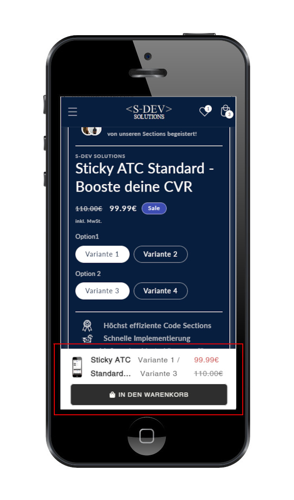
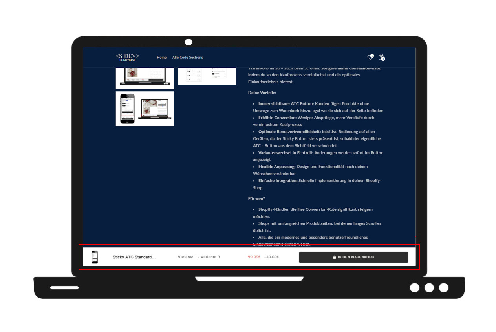

# 🛒 Sticky ATC 

A minimal, flexible “Add to Cart” sticky bar for Shopify product pages that appears when the default ATC button is out of view. Fully customizable and optimized for mobile and desktop.

---

## ✨ Features

- Dynamically appears when the original ATC button is not visible
- Responsive layout for mobile and desktop
- Displays product title, variant title, image (optional), price and compare-at price
- Fully styled sticky bar with motion effects (slide + optional shake)
- Works without jQuery
- Button click forwards to the original Shopify ATC button
- Auto-hides when the native ATC button is in viewport
- Optimized for **Dawn** and compatible with other themes
- Customize everything via section settings: font, size, button styles, shake effect, visibility rules

---

## ⚙️ Settings Overview

| Setting                    | Description                               |
|---------------------------|-------------------------------------------|
| Custom ATC Selector       | Optional selector for native Atc button   |
| Font                      | Choose custom font for sticky bar         |
| Font sizes                | Title, variant, price & button font sizes |
| Color settings            | Button text and background color          |
| Enable image              | Show product image (mobile/desktop-aware) |
| Enable shake              | Animate button for extra attention        |
| Disable on desktop        | Optional toggle to show only on mobile    |
| Initial visibility        | Show before first scrolling to main ATC button  |

---

## 🎯 Use Cases
- Increase mobile conversion rates
- Keep ATC always accessible
- Highlight promo products
- Simplify checkout flow

---

📱 Responsive Behavior
- The sticky bar adapts fluidly to mobile, tablet, and desktop viewports.
- Button, text, and image sizes scale for readability and accessibility on smaller screens.
- The bar can be disabled on desktop or mobile depending on configuration.
- Motion effects (slide, shake) work consistently across devices.

---

## 📱 Mobile View

## 💻 Desktop View

---

## 📐 Additional Infos & Theme Compatibility

- The sticky bar only appears **after** the original ATC button has been scrolled out of view.
- The Visible initially? setting prevents sticky bar from showing until the main ATC has appeared at least once.
- The sticky section listens for variant:change events and reloads its contents accordingly.
- Works out of the box with most Dawn-based themes. Custom ATC Selector ensures broader compatibility.
- Price & compare price are updated live on variant change.
- Compatible with all themes, but ensure the main add-to-cart button uses `name="add"`. If not, change this selector via section settings

---

## 💻 Demo

➡️ [View Live Demo](https://testshopstefanegger.myshopify.com/products/sticky-atc-standard)
PW: sdev

---

## 🧑‍💻 Author

Built by SDEV Solutions – Shopify Theme Development
→ Clean Liquid, CSS, HTML, JS, and Theme Editor logic.
Works with all Shopify 2.0-compatible themes.

